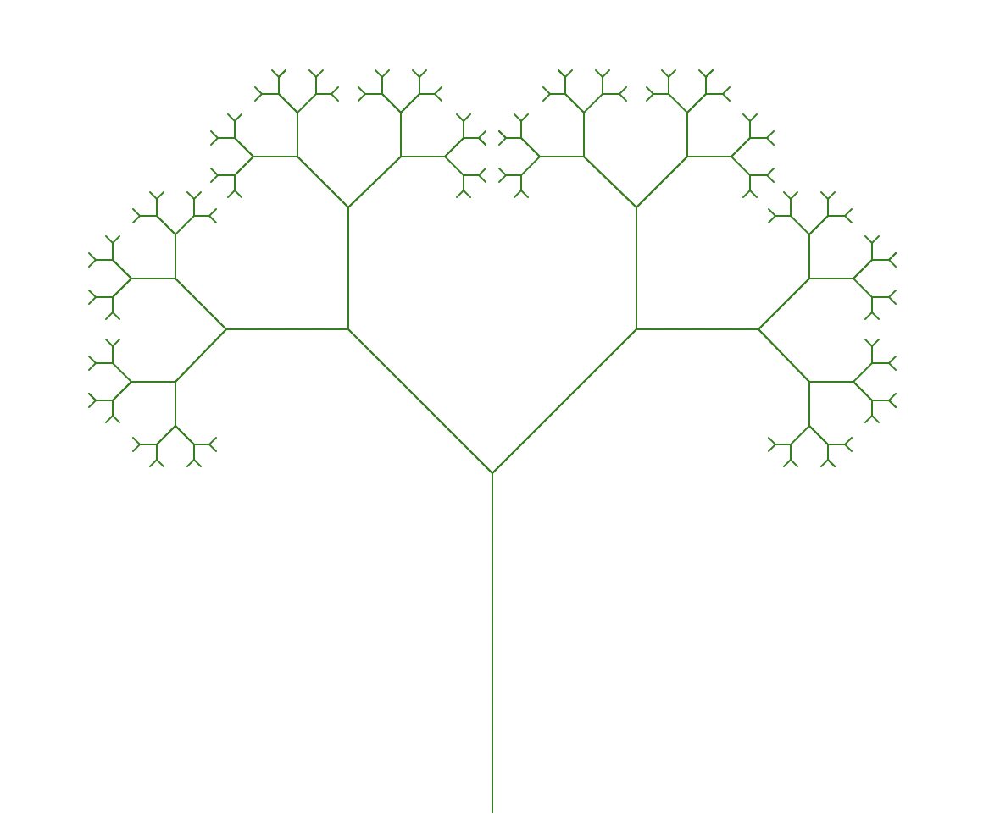

# goit-algo-hw-final

ТАСК 1:

Hаписати функцію, яка реалізує реверсування однозв'язного списку, змінюючи посилання між вузлами

Початковий список:

26 -> 34 -> 4 -> 30 -> 18 -> 16 -> 30 -> 4 -> 40 -> 48 -> None

Реверсивний список:

48 -> 40 -> 4 -> 30 -> 16 -> 18 -> 30 -> 4 -> 34 -> 26 -> None

Розробити алгоритм сортування для однозв'язного списку, сортування вставками

Початковий список:

16 -> 16 -> 31 -> 2 -> 31 -> 47 -> 24 -> 45 -> 11 -> 3 -> None

Сортований список:

2 -> 3 -> 11 -> 16 -> 16 -> 24 -> 31 -> 31 -> 45 -> 47 -> None

Написати функцію, що об'єднує два відсортовані однозв'язні списки в один відсортований список

Початковий список:

2 -> 3 -> 11 -> 16 -> 16 -> 24 -> 31 -> 31 -> 45 -> 47 -> None

9 -> 16 -> 17 -> 23 -> 27 -> 34 -> 41 -> 44 -> 46 -> 47 -> None

Зʼєднаний список:

2 -> None

2 -> 3 -> None

2 -> 3 -> 9 -> None

2 -> 3 -> 9 -> 11 -> None

2 -> 3 -> 9 -> 11 -> 16 -> None

2 -> 3 -> 9 -> 11 -> 16 -> 16 -> None

2 -> 3 -> 9 -> 11 -> 16 -> 16 -> 16 -> None

2 -> 3 -> 9 -> 11 -> 16 -> 16 -> 16 -> 17 -> None

2 -> 3 -> 9 -> 11 -> 16 -> 16 -> 16 -> 17 -> 23 -> None

2 -> 3 -> 9 -> 11 -> 16 -> 16 -> 16 -> 17 -> 23 -> 24 -> None

2 -> 3 -> 9 -> 11 -> 16 -> 16 -> 16 -> 17 -> 23 -> 24 -> 27 -> None

2 -> 3 -> 9 -> 11 -> 16 -> 16 -> 16 -> 17 -> 23 -> 24 -> 27 -> 31 -> None

2 -> 3 -> 9 -> 11 -> 16 -> 16 -> 16 -> 17 -> 23 -> 24 -> 27 -> 31 -> 31 -> None

2 -> 3 -> 9 -> 11 -> 16 -> 16 -> 16 -> 17 -> 23 -> 24 -> 27 -> 31 -> 31 -> 34 -> None

2 -> 3 -> 9 -> 11 -> 16 -> 16 -> 16 -> 17 -> 23 -> 24 -> 27 -> 31 -> 31 -> 34 -> 41 -> None

2 -> 3 -> 9 -> 11 -> 16 -> 16 -> 16 -> 17 -> 23 -> 24 -> 27 -> 31 -> 31 -> 34 -> 41 -> 44 -> None

2 -> 3 -> 9 -> 11 -> 16 -> 16 -> 16 -> 17 -> 23 -> 24 -> 27 -> 31 -> 31 -> 34 -> 41 -> 44 -> 45 -> None

2 -> 3 -> 9 -> 11 -> 16 -> 16 -> 16 -> 17 -> 23 -> 24 -> 27 -> 31 -> 31 -> 34 -> 41 -> 44 -> 45 -> 46 -> None

2 -> 3 -> 9 -> 11 -> 16 -> 16 -> 16 -> 17 -> 23 -> 24 -> 27 -> 31 -> 31 -> 34 -> 41 -> 44 -> 45 -> 46 -> 47 -> None

2 -> 3 -> 9 -> 11 -> 16 -> 16 -> 16 -> 17 -> 23 -> 24 -> 27 -> 31 -> 31 -> 34 -> 41 -> 44 -> 45 -> 46 -> 47 -> 47 -> None

ТАСК 2:

